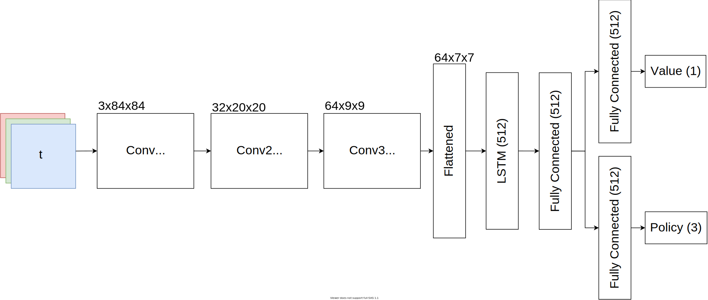
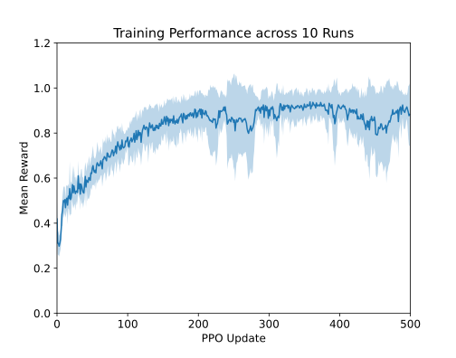
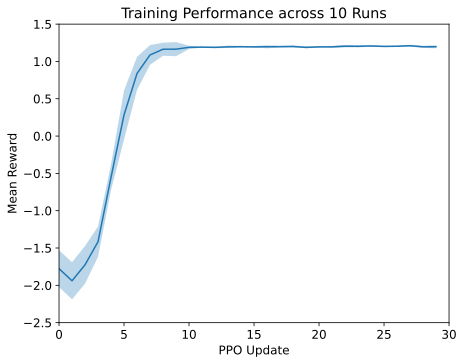
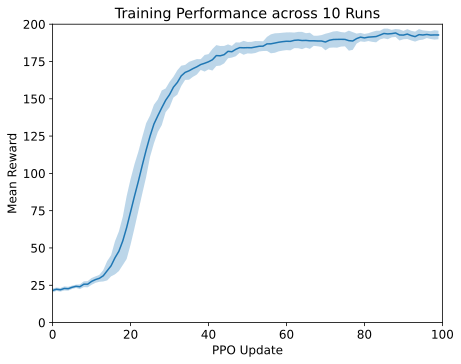

# Recurrent Proximal Policy Optimization using Truncated BPTT

This repository features a PyTorch based implementation of PPO using a recurrent policy supporting truncated backpropagation through time. Its intention is to provide a clean baseline/reference implementation on how to successfully employ recurrent neural networks alongside PPO and similar policy gradient algorithms.

We also offer a clean [TransformerXL + PPO baseline repository](https://github.com/MarcoMeter/episodic-transformer-memory-ppo).

# Latest Updates (February 2023)

- Added support for Memory Gym
- Added yaml configs
- Added max grad norm hyperparameter to the config
- Gymnasium is used instead of gym
- Only model inputs are padded now
- Buffer tensors are freed from memory after optimization
- Fixed dynamic sequence length

# Features

- Recurrent Policy
  - GRU
  - LSTM
  - Truncated BPTT
- Environments
  - Proof-of-concept Memory Task (PocMemoryEnv)
  - CartPole
    - Masked velocity
  - Minigrid Memory
    - Visual Observation Space: 3x84x84
    - Egocentric Agent View Size: 3x3 (default 7x7)
    - Action Space: forward, rotate left, rotate right
  - [MemoryGym](https://github.com/MarcoMeter/drl-memory-gym)
    - Mortar Mayhem
    - Mystery Path
    - Searing Spotlights (WIP)
- Tensorboard
- Enjoy (watch a trained agent play)

# Citing this Work

```bibtex
@inproceedings{
  pleines2023memory,
  title={Memory Gym: Partially Observable Challenges to Memory-Based Agents},
  author={Marco Pleines and Matthias Pallasch and Frank Zimmer and Mike Preuss},
  booktitle={International Conference on Learning Representations},
  year={2023},
  url={https://openreview.net/forum?id=jHc8dCx6DDr}
}
```

# Documentation Contents

- [Installation](#installation)
- [Train a model](#train-a-model)
- [Enjoy a model](#enjoy-a-model)
- [Recurrent Policy](#recurrent-policy)
  - [Implementation Concept](#implementation-concept)
      - [Flow of processing the training data](#flow-of-processing-the-training-data)
  - [Found & Fixed Bugs](#found--fixed-bugs)
      - [Feeding None to nn.GRU/nn.LSTM](#feeding-none-to-nngrunnlstm)
      - [Reshaping an Entire Batch into Sequences](#reshaping-an-entire-batch-into-sequences)
      - [Hidden States were not reset](#hidden-states-were-not-reset)
- [Hyperparameters (configs.py)](#hyperparameters-configspy)
      - [Recurrence](#recurrence)
      - [General](#general)
      - [Schedules](#schedules)
- [Model Architecture](#model-architecture)
- [Add environment](#add-environment)
- [Tensorboard](#tensorboard)
- [Results](#results)
  - [MinigridMemory-S9](#minigridmemory-s9)
  - [MinigridMemoryRandom-S17](#minigridmemoryrandom-s17)
  - [PoC Memory Task](#poc-memory-task)
  - [Cartpole Masked Velocity](#cartpole-masked-velocity)

# Installation

Install [PyTorch](https://pytorch.org/get-started/locally/) depending on your platform. We recommend the usage of [Anaconda](https://www.anaconda.com/).

Create Anaconda environment:
```bash
conda create -n recurrent-ppo python=3.11 --yes
conda activate recurrent-ppo
```

CPU:
```bash
conda install pytorch torchvision torchaudio cpuonly -c pytorch
```

CUDA:
```bash
conda install pytorch torchvision torchaudio pytorch-cuda=11.7 -c pytorch -c nvidia
```

Install the remaining requirements and you are good to go:

```bash
pip install -r requirements.txt
```

# Train a model

The training is launched via the command `python train.py`.

```
Usage:
    train.py [options]
    train.py --help

Options:
    --run-id=<path>            Specifies the tag of the tensorboard summaries and the model's filename [default: run].
    --cpu                      Whether to enforce training on the CPU, otherwwise an available GPU will be used. [default: False].
```

Hyperparameters are configured inside of `configs.py`. The to be used config has to be specified inside of `train.py`. Once the training is done, the final model will be saved to `./models/run-id.nn`. Training statistics are stored inside the `./summaries` directory.

```python train.py --run-id=my-training-run```

# Enjoy a model

To watch an agent exploit its trained model, execute the `python enjoy.py` command.
Some already trained models can be found inside the `models` directory!

```
Usage:
    enjoy.py [options]
    enjoy.py --help

Options:
    --model=<path>              Specifies the path to the trained model [default: ./models/minigrid.nn].
```

The path to the desired model has to be specified using the `--model` flag:

```python enjoy.py --model=./models/minigrid.nn```

# Recurrent Policy

## Implementation Concept

#### Flow of processing the training data

1. Training data
   1. Training data is sampled from the current policy
   2. Sampled data is split into episodes
   3. Episodes are split into sequences (based on the `sequence_length` hyperparameter)
   4. Zero padding is applied to retrieve sequences of fixed length
   5. Recurrent cell states are collected from the beginning of the sequences (truncated bptt)
2. Forward pass of the model
   1. While feeding the model for optimization, the data is flattened to feed an entire batch (faster)
   2. Before feeding it to the recurrent layer, the data is reshaped to `(num_sequences, sequence_length, data)`
3. Loss computation
   1. Zero padded values are masked during the computation of the losses

## Found & Fixed Bugs

As a reinforcement learning engineer, one has to have high endurance. Therefore, we are providing some information on the bugs that slowed us down for months.

#### Feeding None to nn.GRU/nn.LSTM

We observed an **exploding value function**. This was due to unintentionally feeding `None` to the recurrent layer. In this case, PyTorch uses zeros for the hidden states as shown by its [source code](https://github.com/pytorch/pytorch/blob/8d50a4e326e10fe29e322753bb90be15546e5435/torch/nn/modules/rnn.py#L662).

```python
if hx is None:
    num_directions = 2 if self.bidirectional else 1
    real_hidden_size = self.proj_size if self.proj_size > 0 else self.hidden_size
    h_zeros = torch.zeros(self.num_layers * num_directions,
                          max_batch_size, real_hidden_size,
                          dtype=input.dtype, device=input.device)
    c_zeros = torch.zeros(self.num_layers * num_directions,
                          max_batch_size, self.hidden_size,
                          dtype=input.dtype, device=input.device)
    hx = (h_zeros, c_zeros)
```

#### Reshaping an Entire Batch into Sequences

Training an agent using a **sequence length greater than 1** caused the agent to just achieve a **performance of a random agent**. The issue behind this bug was found in reshaping the data right before feeding it to the recurrent layer. In general, the desire is to feed the entire training batch instead of sequences to the encoder (e.g. convolutional layers). Before feeding the processed batch to the recurrent layer, it has to be rearranged into sequences. At the point of this bug, the recurrent layer was initialized with `batch_first=False`. Hence, the data was reshaped using `h.reshape(sequence_length, num_sequences, data)`. This messed up the structure of the sequences and ultimately caused this bug. We fixed this by setting `batch_first` to `True` and therefore reshaping the data by `h.reshape(num_sequences, sequence_length, data)`.

#### Hidden States were not reset

This is rather considered as a feature and not a bug. For environments that produce rather short episodes are likely to take advantage of not resetting the hidden states upon commencing a new episode. This is the case for MinigridMemory-S9. Resetting hidden states is now controlled by the hyperparameter `reset_hidden_state` inside configs.py. The actual mistake was the mixed up order of saving the recurrent cell to its respective placeholder and resetting it.

# Hyperparameters (configs.py)

#### Recurrence

<table>
  <thead>
    <tr>
      <th>Hyperparameter</th>
      <th>Description</th>
    </tr>
  </thead>
  <tbody>
    <tr>
      <td>sequence_length</td>
      <td>Length of the trained sequences, if set to 0 or smaller the sequence length is dynamically fit to episode lengths</td>
    </tr>
    <tr>
      <td>hidden_state_size</td>
      <td>Size of the recurrent layer's hidden state</td>
    </tr>
    <tr>
      <td>layer_type</td>
      <td>Supported recurrent layers: gru, lstm</td>
    </tr>
    <tr>
      <td>reset_hidden_state</td>
      <td>Whether to reset the hidden state upon starting a new episode. This can be beneficial for environments that produce short episodes like MinigridMemory-S9.</td>
    </tr>
  </tbody>
</table>

#### General

<table>
  <tbody>
    <tr>
      <td>gamma</td>
      <td>Discount factor</td>
    </tr>
    <tr>
      <td>lamda</td>
      <td>Regularization parameter used when calculating the Generalized Advantage Estimation (GAE)</td>
    </tr>
    <tr>
      <td>updates</td>
      <td>Number of cycles that the entire PPO algorithm is being executed</td>
    </tr>
    <tr>
      <td>n_workers</td>
      <td>Number of environments that are used to sample training data</td>
    </tr>
    <tr>
      <td>worker_steps</td>
      <td>Number of steps an agent samples data in each environment (batch_size = n_workers * worker_steps)</td>
    </tr>
    <tr>
      <td>epochs</td>
      <td>Number of times that the whole batch of data is used for optimization using PPO</td>
    </tr>
    <tr>
      <td>n_mini_batch</td>
      <td>Number of mini batches that are trained throughout one epoch</td>
    </tr>
    <tr>
      <td>value_loss_coefficient</td>
      <td>Multiplier of the value function loss to constrain it</td>
    </tr>
    <tr>
      <td>hidden_layer_size</td>
      <td>Number of hidden units in each linear hidden layer</td>
    </tr>
    <tr>
      <td>max_grad_norm</td>
      <td>Gradients are clipped by the specified max norm</td>
    </tr>
  </tbody>
</table>

#### Schedules

These schedules can be used to polynomially decay the learning rate, the entropy bonus coefficient and the clip range.

<table>
    <tbody>
    <tr>
      <td>learning_rate_schedule</td>
      <td>The learning rate used by the AdamW optimizer</td>
    </tr>
    <tr>
      <td>beta_schedule</td>
      <td>Beta is the entropy bonus coefficient that is used to encourage exploration</td>
    </tr>
    <tr>
      <td>clip_range_schedule</td>
      <td>Strength of clipping optimizations done by the PPO algorithm</td>
    </tr>
  </tbody>
</table>

# Model Architecture



The figure above illustrates the model architecture in the case of training Minigrid. The visual observation is processed by 3 convolutional layers. The flattened result is then divided into sequences before feeding it to the recurrent layer. After passing the recurrent layer's result to one hidden layer, the network is split into two streams. One computes the value function and the other one the policy. All layers use the ReLU activation.

In the case of training an environment that utilizes vector observations only, the visual encoder is omitted and the observation is fed directly to the recurrent layer.

# Add environment

Follow these steps to train another environment:

1. Extend the create_env() function in utils.py by adding another if-statement that queries the environment's name
2. At this point you could simply use gym.make() or use a custom environment that builds on top of the gym interface.
3. Adjust the "env" key inside the config dictionary to match the name of the new environment

# Tensorboard

During training, tensorboard summaries are saved to `summaries/run-id/timestamp`.

Run `tensorboad --logdir=summaries` to watch the training statistics in your browser using the URL [http://localhost:6006/](http://localhost:6006/).

# Results

The code for plotting the results can be found in the results directory.
Results on Memory Gym can be found in our [TransformerXL + PPO baseline repository](https://github.com/MarcoMeter/episodic-transformer-memory-ppo).

## MinigridMemory-S9



## MinigridMemoryRandom-S17

(only trained on MinigridMemory-S9 using unlimited seeds)


## PoC Memory Task



## Cartpole Masked Velocity



