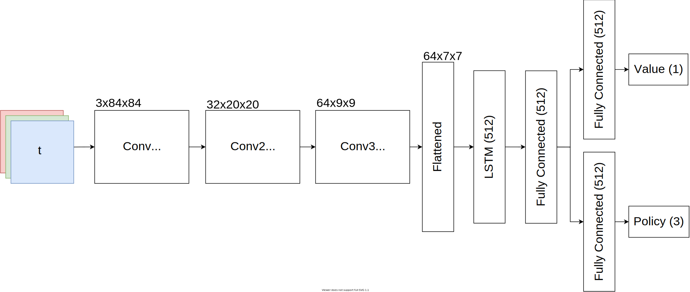

- [Installation](#installation)
- [Train a model](#train-a-model)
- [Enjoy a model](#enjoy-a-model)
- [Recurrent Policy](#recurrent-policy)
  - [Implementation Concept](#implementation-concept)
      - [Flow of processing the training data](#flow-of-processing-the-training-data)
  - [Found & Fixed Bugs](#found--fixed-bugs)
      - [Feeding None to nn.GRU/nn.LSTM](#feeding-none-to-nngrunnlstm)
      - [Reshaping an Entire Batch into Sequences](#reshaping-an-entire-batch-into-sequences)
- [Model Architecture](#model-architecture)
- [Add environment](#add-environment)
- [Tensorboard](#tensorboard)
- [Plotting Results](#plotting-results)

# Installation

Install [PyTorch](https://pytorch.org/get-started/locally/) 1.8.1 depending on your platform.

CPU:

`pip install torch==1.8.1+cpu torchvision==0.9.1+cpu torchaudio==0.8.1 -f https://download.pytorch.org/whl/lts/1.8/torch_lts.html`

CUDA:

`pip install torch==1.8.1+cu111 torchvision==0.9.1+cu111 torchaudio==0.8.1 -f https://download.pytorch.org/whl/lts/1.8/torch_lts.html`

Install the remaining requirements and you are good to go:
`pip install -r requirements.txt`

# Train a model

The training is launched via the command `python train.py`.

```
Usage:
    train.py [options]
    train.py --help

Options:
    --run-id=<path>            Specifies the tag of the tensorboard summaries and the model's filename [default: run].
    --cpu                      Whether to enforce training on the CPU, otherwwise an available GPU will be used. [default: False].
```

Hyperparameters are configured inside of `configs.py`. The to be used config has to be specified inside of `train.py`. Once the training is done, the final model will be saved to `./models/run-id.nn`. Training statistics are stored inside the `./summaries` directory.

```python train.py --run-id=my-training-run```

# Enjoy a model

To watch an agent exploit its trained model, execute the `python enjoy.py` command.
Some already trained models can be found inside the `models` directory!

```
Usage:
    enjoy.py [options]
    enjoy.py --help

Options:
    --model=<path>              Specifies the path to the trained model [default: ./models/minigrid.nn].
```

The path to the desired model has to be specified using the `--model` flag:

```python enjoy.py --model=./models/minigrid.nn```

# Recurrent Policy

## Implementation Concept

#### Flow of processing the training data

1. Training data
   1. Training data is sampled from the current policy
   2. Sampled data is split into episodes
   3. Episodes are split into sequences (based on the `sequence_length` hyperparameter)
   4. Zero padding is applied to retrieve sequences of fixed length
   5. Recurrent cell states are collected from the beginning of the sequences (truncated bptt)
2. Forward pass of the model
   1. While feeding the model for optimization, the data is flattened to feed an entire batch (faster)
   2. Before feeding it to the recurrent layer, the data is reshaped to `(num_sequences, sequence_length, data)`
3. Loss computation
   1. Zero padded values are masked during the computation of the losses

## Found & Fixed Bugs

As a reinforcement learning engineer, one has to have high endurance. Therefore, we are providing some information on the bugs that slowed us down for months.

#### Feeding None to nn.GRU/nn.LSTM

We observed an **exploding value function**. This was due to unintentionally feeding None to the recurrent layer. In this case, PyTorch uses zeros for the hidden states as shown by its [source code](https://github.com/pytorch/pytorch/blob/8d50a4e326e10fe29e322753bb90be15546e5435/torch/nn/modules/rnn.py#L662).

```python
if hx is None:
    num_directions = 2 if self.bidirectional else 1
    real_hidden_size = self.proj_size if self.proj_size > 0 else self.hidden_size
    h_zeros = torch.zeros(self.num_layers * num_directions,
                          max_batch_size, real_hidden_size,
                          dtype=input.dtype, device=input.device)
    c_zeros = torch.zeros(self.num_layers * num_directions,
                          max_batch_size, self.hidden_size,
                          dtype=input.dtype, device=input.device)
    hx = (h_zeros, c_zeros)
```

#### Reshaping an Entire Batch into Sequences

Training an agent using a **sequence length greater than 1** caused the agent to just achieve a **performance of a random agent**. The issue behind this bug was found in reshaping the data right before feeding it to the recurrent layer. In general, the desire is to feed the entire training batch instead of sequences to the encoder (e.g. convolutional layers). Before feeding the processed batch to the recurrent layer, it has to be rearranged into sequences. At the point of this bug, the recurrent layer was initialized with `batch_first=False`. Hence, the data was reshaped using `h.reshape(sequence_length, num_sequences, data)`. This messed up the structure of the sequences and ultimately caused this bug. We fixed this by setting `batch_first` to `True` and therefore reshaping the data by `h.reshape(num_sequences, sequence_length, data)`.

# Model Architecture



The figure above illustrates the model architecture in the case of training Minigrid. The visual observation is processed by 3 convolutional layers. The flattened result is then divided into sequences before feeding it to the recurrent layer. After passing the recurrent layer's result to one hidden layer, the network is split into two streams. One computes the value function and the other one the policy.

In the case of training an environment that utilizes vector observations only, the visual encoder is omitted and the observation is fed directly to the recurrent layer.

# Add environment

Follow these steps to train another environment:

1. Extend the create_env() function in utils.py by adding another if-statement that queries the environment's name
2. At this point you could simply use gym.make() or use a custom environment that builds on top of the gym interface.
3. Adjust the "env" key inside the config dictionary to store the name of the new environment

# Tensorboard

During training, tensorboard summaries are saved to `summaries/run-id/timestamp`.

Run `tensorboad --logdir=summaries` to watch the training statistics in your browser using the URL [http://localhost:6006/](http://localhost:6006/).

# Plotting Results
